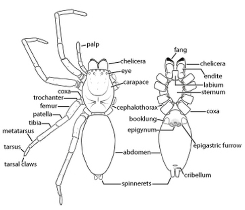
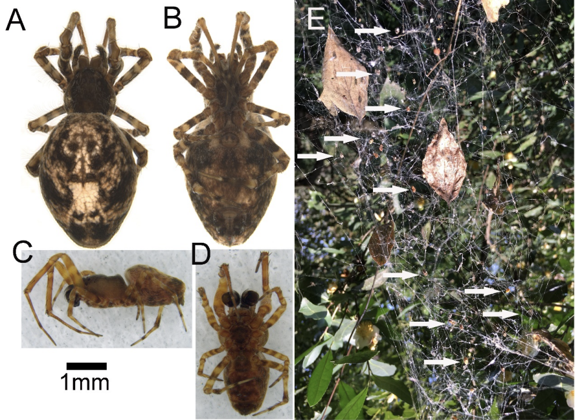
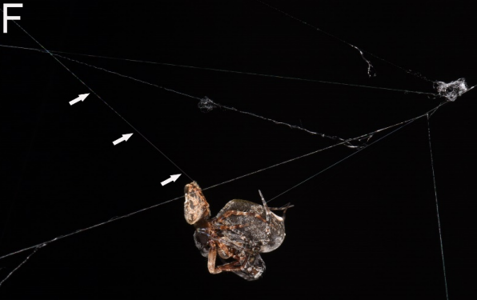
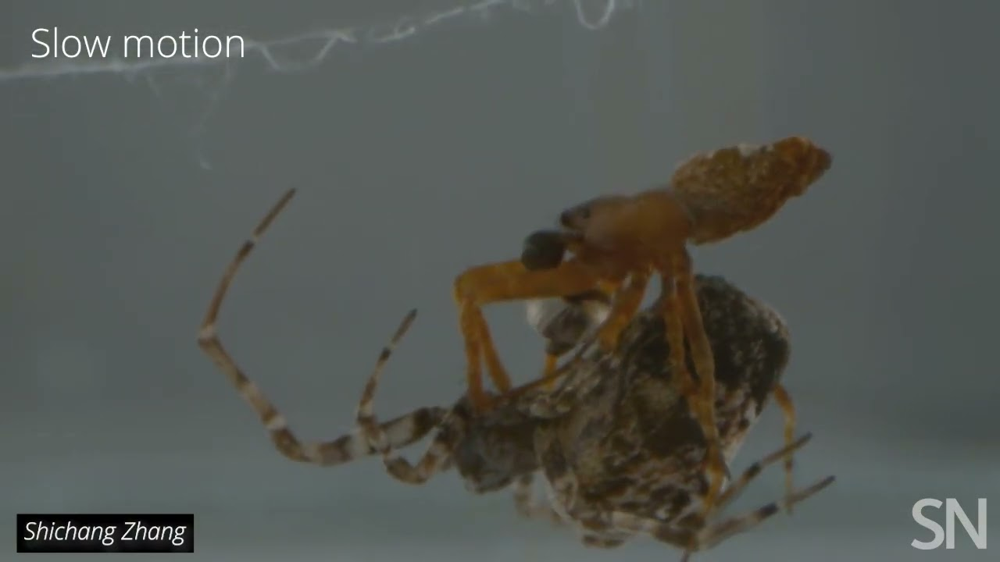
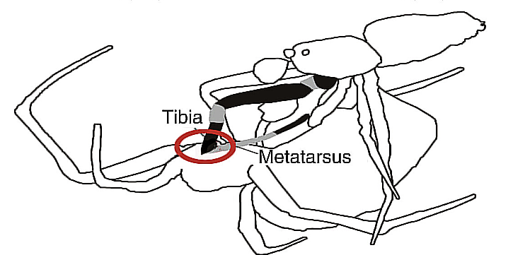
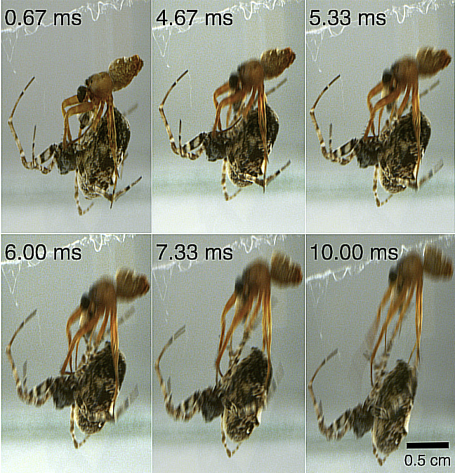
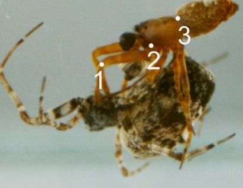
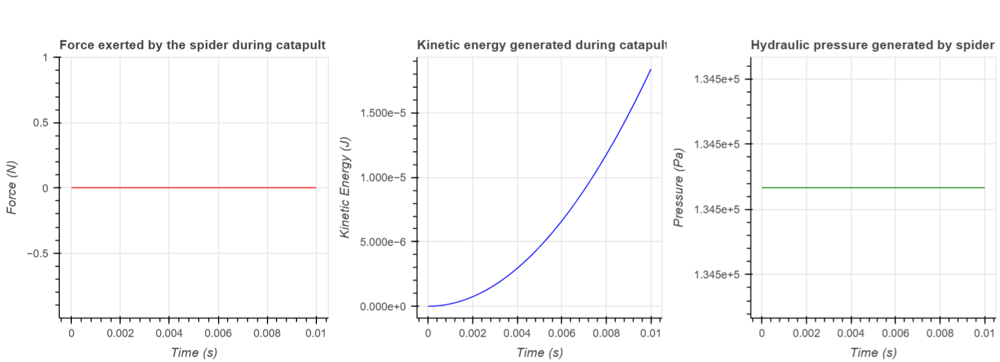
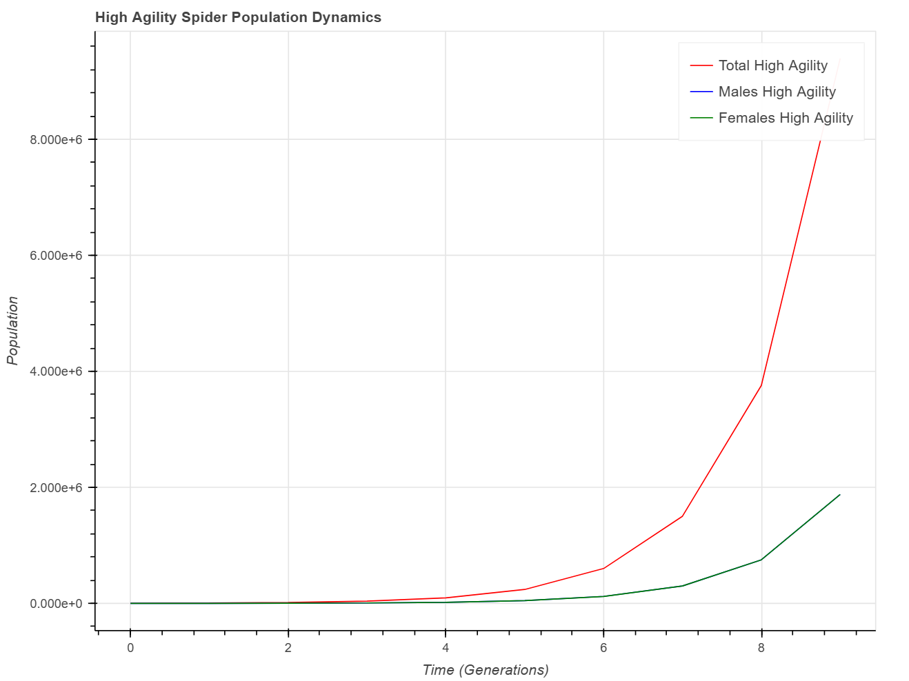
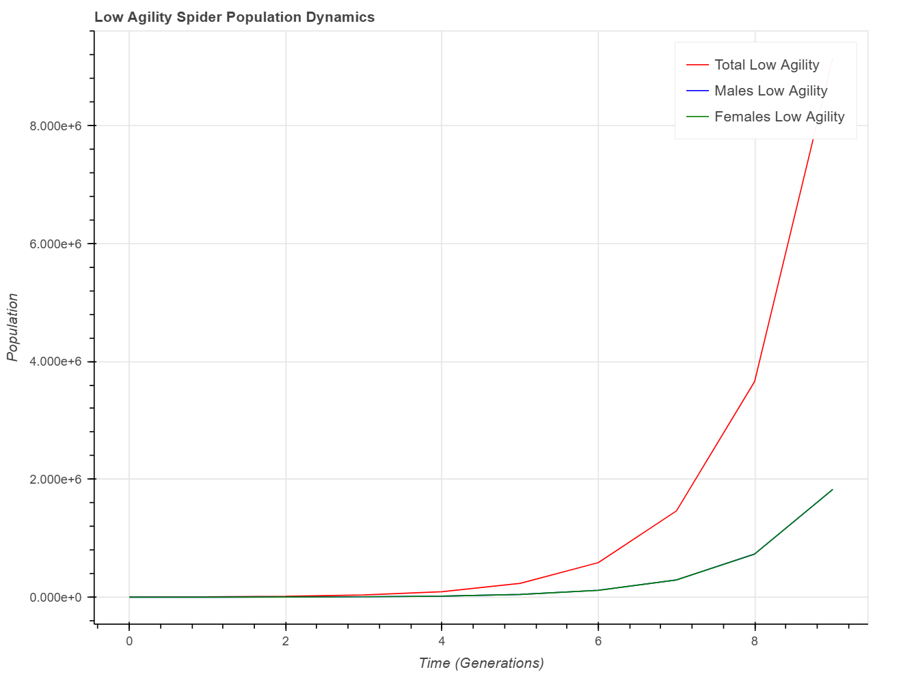

## 1. Introduction

In this notebook we will try to investigate and simulate the physics of the catapulting mechanism observed in  Philoponella prominens also known as orb-weaver spiders and later run a simulation to see post coital survival of male spiders and how it affects the population dynamics in an orb weaver colony. The first few cells discuss the findings and experiments done in lab by the researchers.In the mid section we delve into simulating the physics of the catapult mechanism and later sections the population simulation of the spiders.

## 2. An Overview of Spider Biology and Ecology


```python
from IPython.display import Image
Image(url='imgs/generic_spider_morphology.jpg', width=500, height=300)
```





### 2.1  Morphology of Spiders 

Spiders belong to the class Arachnida and to the order Araneae. As of November 2023, taxonomists have recoded 51673 spider species belonging to 136 families. Spiders are considered the seventh most diverse order of all organisms.In all suborders except the primitive suborder the Mesothelae, spiders have the most centralized nervous system of all arthorpods. Spider are anatomically different from other arthropods as well; their body is divided into two segments cephalothorax and abdomen, whereas the body of other  arthropods(insects) is divided into three segments: head thorax and abdomen,they do not have wings and antennae like other insects. Spiders also have a hard exoskeleton and appendages with multiple joints, which allows them to move with precision and agility. The hard exoskeleton provides protection against predetors and natural forces. The appendages, which consists of legs and pedipalps which are crucial for locomotion, capturing the prey, sensing the enviornment and facilitating reproduction. The anterior part of the spider also has specialised appendages called chelicera which essentially are mouthparts of spider and often reffered as jaws or fangs, which enable the spider to hold onto the prey and inject venom through the tips of the fangs. Spider venom falls into two categories neurotoxic (impairing the nervous system) or neurotic (dissolving tissues around the bite) In some cases the venom targets vital organs too. Spiders have both venom and silk glands. The abdomen also bears appendages that consists of spinnerets that extrude silk from the silk glands.

### 2.2 Predation and Biodiversity

Spiders have eyes in the anterior section of their body.Eyes are instrumental in hunting and web building and determining spiders orientation in world space. Statistics show that 99% of spiders have eight eyes. Some spiders have six, four or two eyes and a few species even have vestigial eys or none at all. Spiders are predators, feeding almost entirely on other arthropods, especially insects. Spiders use a variety of methods to capture prey some spiders build traps using webs while others are active hunters who chase and overpower their prey in doing so they play a very important ecological role in maintaining the balance if various ecosystems by controlling insect populations, thus preventing outbreaks  that could harm other species. Their presence promotes biodiversity and ensures the overall health of natural environments. Spiders are grouped in various genera, which include species like wolf spiders, hunting spiders, sac-spiders, Orb-weaver spiders(circular webs) and funnel web spiders.


```python
Image(url='imgs/dorsal_ventral_view_m_f_orb.png', width=500, height=350)
```





## 3. Catapulting behavior and cannibalism in Orb-Weaver Spiders

Reserchers observed a novel manuevering mechanism in the communal orb-weaving spider Philoponella prominens (Uloboridae) which is part of a family known as the hackled orb weavers. They obseved that the male spiders of the species catapult themselves off of the much larger female spiders using their front pair of legs after mating in order to avoid being cannibalized by the female. If they fail to escape, the female spiders mummify the males by wrapping them in silk as these spiders don’t have venom in them. The female spiders wrap the males tightly enough that their legs break and they either are crushed to death or die of suffocation. The males also setup an anchored safety web-line before mating. The safety line may prevent the male from dropping, and ensures that it can climb back to the female web for further mating attempts.

(A) Female dorsal view. (B) Female ventral view. (C)Male lateral view.
(D) Male ventral view. (E) A colonial web complex of P. prominens (white arrows indicate the spiders).
(F) A mating pair of P. prominens with the male spider's safety line (white arrows)
(SN) Zoomed image of P. prominens mating


```python
Image(url='imgs/safety_line_mating.png', width=500, height=350)
```





```python
Image(url='imgs/orb-weaver_mating.jpg', width=500, height=350)
```





```python
%%HTML
<iframe width="600" height="350" src="https://www.youtube.com/embed/j4DdbTiF00U?si=L7F4d3o89rXsDYz9" title="YouTube video player" frameborder="0" allow="accelerometer; autoplay; clipboard-write; encrypted-media; gyroscope; picture-in-picture; web-share" allowfullscreen></iframe>
```


<iframe width="600" height="350" src="https://www.youtube.com/embed/j4DdbTiF00U?si=L7F4d3o89rXsDYz9" title="YouTube video player" frameborder="0" allow="accelerometer; autoplay; clipboard-write; encrypted-media; gyroscope; picture-in-picture; web-share" allowfullscreen></iframe>


### 3.1 Mating process

Spiders have specialized structures for reproduction.Although spermatogenesis is not yet fully understood in spiders,we know that the male spiders produce sperm within their body which is then released through a process called sperm induction. The male draws the sperm into his pedipalps, which are appendages near the mouth that have been modified to hold sperm and also serve as copulatory organs. The female spider's reproductive system consists of two ovaries connected by tubes where fertilization occurs. During mating the male inserts his pedipalp into the female's genital opening(epigyne) to transfer his sperm.After mating, the female stores the male spiders sperm in a special chamber untill she's ready to lay eggs. When laying eggs, she releases them into an egg sac made from her silk, where they get fertilized by the stored sperm. 

In the case of orb-weaver spiders we have a unique mating behaviour involving post coital cannabalism by females and catapulting behaviour in males in order to avoid being cannabalised.


```python
Image(url='imgs/tibia_metatarsus.png', width=500, height=350)
```





### 3.2 Catapult Mechanism

The reserchers identified that the tibia-metatarsus joint of the first pair of forelegs of the male spider is crucial to the catapulting behaviour and they also found there are thecae which are enveloping sheathes covering the joints, the thecae has elatic properties for extension and contraction(found in all joints in the legs)which are filled with microfluids as they are hollow and do not conatin extensor muscles.Extensor muscles are muscles that cause the extension or straightening and the microfluids could be hemolymphs(blood). They hypothesized that the folded leg against the female when released, the hydraulic pressure created by microfluids causes the legs to rapidly expand resulting in the catapult mechanism.Also the theca surface area in the tibia–metatarsus joint in the first pair of forelegs was found to be significantly larger (mean $\pm$ SE: $0.03 \pm 0.002$ mm$^2$, $N = 10$)
 than any other legs suggesting that this variation might be related to the kinematic performance of catapulting, and the fitness of the male spiders.


```python
Image(url='imgs/high_speed_shots_kinematic_parameter_calculation.png', width=300, height=200)
```





```python
Image(url='imgs/nodal_points.jpeg', width=300, height=100)
```





### 3.4 Results of Kinematic Parameter Calculations

To investigate the catapult mechanism, high speed cameras with a frame rate of 1500/s were used by the researchers. The snapshots of the spiders catapulting were used to measure the distance moved accross in each frame by doing Kinematic Parameter Calculations on movement of the spider.They were tracking three nodal points in the spider over time, specifically 

* 1 the joint between femur and patella 
* 2 the trochanter 
* 3 the joint between cephalothorax and abdomen 

Kinematic parameters are quantites that describe the motion of an object , such as velocity, acceleration, displacement and time. There are four kinematic equations that can be used to derive different quantities depending on which variables are known and unknown:

$$v = v_0 + at$$

$$\Delta x = \frac{v + v_0}{2}t$$

$$\Delta x = v_0t + \frac{1}{2}at^2$$

$$v^2 = v_0^2 + 2a\Delta x$$

where (v) is the final velocity (v0) is the initial velocity (a) and time interval (t) during which the acceleration is constant. Also Δx represents the displacement of the object, which is the change in its position. These equations are valid only for constant acceleration and one-dimensional motion. Using the formulas above, calculations were done using the trajectories of the male spiders catapult motion from the high resolution images. During the catapult the male spiders spinnerets were also found to be doing revolutions.

In a set of 5 observations, the researchers found that the mean peak speed (relative velocity) was $65.9 \pm 9.8$ cm/s (mean $\pm$ SE, $N = 5$), ranging from $31.6$ to $88.2$ cm/s. The peak acceleration averaged $201.7 \pm 84.1$ m/s$^2$ (mean $\pm$ SE, $N = 5$), ranging from $74.2$ to $528.7$ m/s$^2$, within an average period of $4.3 \pm 0.3$ ms (mean $\pm$ SE, $N = 5$) (Figure 1B--G). The spin rate of the male during catapulting was $173.4 \pm 61.9$ rev/s (mean $\pm$ SE, $N = 5$), with a maximum recorded rate of $469.2$ rev/s. These results will be the basis of our simulation. 

# Implementation

In this section we will implement our model using the results from the research. The model simulates the force exerted by the spider during the jump, the kinetic energy generated during the jump, and the hydraulic pressure generated by the microfluids in its legs. These calculations are based on the spider's mass, speed, acceleration, and the cross-sectional area of the spider's leg. They don't involve the angle of the spider's joint. We will also dissect the functions involved in the model and the formulas used in the next sections.

### Theoretical Analysis

We will first list all the know values and deduce and assume to adjust for unknown values (for male spider):

* spider mass : `10 mg` (assumed) we know that the male spiders body length is 1mm [c]

* spider speed : `65.9 cm/s` [3.4]

* spider acceleration : `0.030 ms²` [3.4]

* cross-sectional area of thecae: `0.030 mm²`[3.2]

We will calculate three physical quantities `Force` `Kinetic Energy` and `Hydraulic Pressure`  
###### Force 

The Force generated during the catapult will be calculated by multiplying the mass (m) of the spider and acceleration (a) observed during the experiments. The Formula comes from Newton's second law of motion. The unit of force is Newton (N). Formula:

$$F = ma$$

###### Kinetic Energy 

The Kinetic energy is energy of the spider in motion during the catapult. Kinetic energy (K) is calculated as 1/2 the mass (m) times the square of the speed (v) of an object in our case the spider. The unit of Kinetic energy is measured in Joules (J) Formula:

$$K = \frac{1}{2}mv^2$$

###### Hydraulic Pressure

Hydraulic pressure is calculated as the force (F) per unit area (A) exerted by a fluid on surface or body in our case the fluid is the microfluid in spiders legs and area is the cross-sectional area of the thecae of both legs. The pressure exerted by the spider is not additive across legs so, when calculating the pressure we will consider the combined area of two legs(forelegs) used for catapulting. The unit of pressure is Pascal (Pa). Formula:

$$P = \frac{F}{A}$$

### Importing Libraries


```python
import numpy as np
import random
import sympy as sym
from bokeh.models import ColumnDataSource
from bokeh.plotting import curdoc, figure
from bokeh.layouts import gridplot
from bokeh.plotting import figure, show
from bokeh.io import output_notebook
from bokeh.plotting import figure, show, output_notebook
from bokeh.models import HoverTool
from IPython.display import display,Math
```

### Parameter settings


```python
spider_mass = 0.00001  # mass in kg 
spider_speed = 0.659  # speed in m/s 
spider_acceleration = 201.7  # acceleration in m/s^2 
cross_sectional_area = 0.000000030  # cross-sectional area of legs(thecae) in m^2
gravity = 9.81 # acceleration due to gravity in m/s^2
jump_duration = 0.010  # duration of the jump in seconds
```

### Simulating the physics of the catapulting behaviour


```python
time = np.linspace(0, jump_duration, 100)  

def force(mass, acceleration):
    return mass * acceleration  

def kinetic_energy(mass, speed):
    return 0.5 * mass * speed**2  

def hydraulic_pressure(force, area):
    return force / area 

force = force(spider_mass, spider_acceleration)
speed = spider_acceleration * time - gravity * time  
kinetic_energy = kinetic_energy(spider_mass, speed)
hydraulic_pressure = (hydraulic_pressure(force, cross_sectional_area)) * 2 

print("Force exerted by the spider during the jump: %g N" %(force))
print("Kinetic energy at peak speed: %g J" %(kinetic_energy[-1]))
print("Hydraulic pressure generated by the spider using two legs: %g Pa" %(hydraulic_pressure))

# Plot force, kinetic energy, and hydraulic pressure using Bokeh
output_notebook()

# Define plot size parameters
width = 335 # width of the plot in pixels
height = 335  # height of the plot in pixels

# Create a new plot for force
p1 = figure(title="Force exerted by the spider during catapult", x_axis_label='Time (s)', y_axis_label='Force (N)', width=width, height=height)
p1.line(time, [force]*len(time), line_color="red")

# Create a new plot for kinetic energy
p2 = figure(title="Kinetic energy generated during catapult", x_axis_label='Time (s)', y_axis_label='Kinetic Energy (J)', width=width, height=height)
p2.line(time, kinetic_energy, line_color="blue")

# Create a new plot for hydraulic pressure
p3 = figure(title="Hydraulic pressure generated by spider", x_axis_label='Time (s)', y_axis_label='Pressure (Pa)', width=width, height=height)
p3.line(time, hydraulic_pressure, line_color="green")

# Show the plots side by side
show(gridplot([[p1, p2, p3]]))
```

    Force exerted by the spider during the jump: 0.002017 N
    Kinetic energy at peak speed: 1.84109e-05 J
    Hydraulic pressure generated by the spider using two legs: 134467 Pa
    





### Results

The model generates the following results

* Force exerted by the spider during the catapult jump is `0.002017 N`

* Kinetic energy generated by the spider during the catapult jump is `1.8410886049999998e-05 J`

* Hydrulic pressure generated by the spider during the catapult jump is `134466.6666666667 Pa`

The pressure calculated is consistent with the existing measurements done on jumps in jumping spiders.

### Future Improvements 

The paper also mentioned `spin rates` of the spider during catapulting which was `173.4 ± 61.9 rev/s` which could also be factored in the model to calculate angular velocity and torque generated. Similarly, There are multiple factors that affect the male spiders during the catapult and are crucial in making the model more accurate like

* The angle of the spider's joint and launch angle
* Atmospheric pressure and body specifications of spider 
* Torsion - twisting force generated
* Tension generated by the spiders body structure
* Air resistance during catapult jump - Drag co-effiecient

These metrics have not been measured yet but if we are able to, then we can simulate the physics more accurately.

## Agility Formula

The survival rate of male spider and the population of spiders depend on the catapulting success therefore If the male spiders maintain  these metrics their chances of post-coital survival increases. The agility formula takes the phenotype agility and defines spiders fitness.

Agility formula is calulated as:


```python
epsilon = 1e-7 # constant to scale for calculation purposes

def agility_formula(force, kinetic_energy, hydraulic_pressure, epsilon):
    force, kinetic_energy, hydraulic_pressure, epsilon = sym.symbols('force kinetic_energy hydraulic_pressure epsilon')
    agility_formula = (force*1000) + (1/(kinetic_energy+epsilon)) + (1/(hydraulic_pressure+epsilon))/3
    display(Math(sym.latex(sym.sympify(agility_formula))))
    
agility_formula(force, kinetic_energy, hydraulic_pressure, epsilon) 
```


$\displaystyle 1000 force + \frac{1}{\epsilon + kinetic_{energy}} + \frac{1}{3 \left(\epsilon + hydraulic_{pressure}\right)}$


```python
epsilon = 1e-7 # constant to scale for calculation
def calculate_agility(force, kinetic_energy, hydraulic_pressure):
          #1 N = 1000 mN
    return ((force*1000)+(1/(kinetic_energy+epsilon))+(1/(hydraulic_pressure+epsilon)))/3
```

## Simulating the post-coital survival of male orb spiders  

Orb weaver spiders (Philoponella prominens) have unique population dynamics because apart from other factors that might impact their population they deal with predation within the polulation itself. Unsurprisingly, the male spiders have evolved to survive the cannibalism behavior shown by the female spiders evidenced by the catapult mechanism.We will now simulate a population of spiders with a focus on the mating process. First we will setup some initial parameters like population size which is denoted by `N`, `time step` is the number of generation. The `Spider` class represents individual spiders in population and each spider has a sex(male or female) assigned along with an agility score. The `mating function` simulates the mating process which is carried out in two steps for each outcome.

* mating  > successful catapult > male spider alive > offspring gets high agility > attempts to mate again
* mating > unsuccessful catapult > male spider dead > offspring gets low agility 


```python
N = 1000 # initial population size
time_steps = 10 
#negative_agility = 0.2 

class Spider:
    def __init__(self, sex, agility):
        self.sex = sex 
        self.agility = agility
        self.alive = True

# male performs catapult mechanism with a success rate calculated based on agility if successful, male survives                         
def mating(male, female): 
    if random.random() < male.agility:  # offspring spider inherits the average of the parents agility with some random variation
        offspring_agility = (male.agility + female.agility) / 2 + np.random.normal(0, 0.01) 
        return [Spider('male', male.agility), Spider('female', female.agility), Spider(random.choice(['male', 'female']), offspring_agility)]
    else:
        male.alive = False # if mating is unsuccessful male gets eaten
        return [Spider('female', female.agility), Spider(random.choice(['male', 'female']), male.agility)]  # offspring gets the agility of the dead male spider
```

Here we are initialisng two populations of spiders. One with a high agility score and another with low agility score and simulating population dynamics for specifeid no of generations.


```python
# initializing two populations of spiders with different agility levels
population_high_agility = [Spider(random.choice(['male', 'female']), calculate_agility(force, kinetic_energy[-1], hydraulic_pressure)) for _ in range(N)]
population_low_agility = [Spider(random.choice(['male', 'female']), calculate_agility(force, kinetic_energy[-1], hydraulic_pressure)) for _ in range(N)]

source_high_agility = ColumnDataSource(data=dict(time=[], population=[], males=[], females=[]))
source_low_agility = ColumnDataSource(data=dict(time=[], population=[], males=[], females=[]))

p_high_agility = figure(title="High Agility Spider Population Dynamics", x_axis_label='Time (Generations)', y_axis_label='Population', width=800, height=600)
p_low_agility = figure(title="Low Agility Spider Population Dynamics", x_axis_label='Time (Generations)', y_axis_label='Population', width=800, height=600)

for p, source, legend in [(p_high_agility, source_high_agility, "High Agility"), (p_low_agility, source_low_agility, "Low Agility")]:
    p.line('time', 'population', source=source, line_color="red", legend_label=f"Total {legend}")
    p.line('time', 'males', source=source, line_color="blue", legend_label=f"Males {legend}")
    p.line('time', 'females', source=source, line_color="green", legend_label=f"Females {legend}")
    p.add_tools(HoverTool(tooltips=[("Time", "@time"), ("Total", "@population"), ("Males", "@males"), ("Females", "@females")]))

for i in range(time_steps):
    for population, source in [(population_high_agility, source_high_agility), (population_low_agility, source_low_agility)]:
        males = [spider for spider in population if spider.sex == 'male' and spider.alive]
        females = [spider for spider in population if spider.sex == 'female']
        
        for female in females:
            if males:
                male = random.choice(males)
                population += mating(male, female)
        
        
        population = [spider for spider in population if spider.alive] # removing dead spiders

        new_data = {'time': [i], 'population': [len(population)], 'males': [len(males)], 'females': [len(females)]}
        source.stream(new_data)

        print(f"Generation {i+1} ({'High' if source == source_high_agility else 'Low'} Agility): {len(population)} spiders - {len(males)} males, {len(females)} females")

output_notebook()
show(p_high_agility)
show(p_low_agility)
```

    Generation 1 (High Agility): 2458 spiders - 514 males, 486 females
    Generation 1 (Low Agility): 2452 spiders - 516 males, 484 females
    Generation 2 (High Agility): 6163 spiders - 1223 males, 1235 females
    Generation 2 (Low Agility): 6064 spiders - 1248 males, 1204 females
    Generation 3 (High Agility): 15460 spiders - 3064 males, 3099 females
    Generation 3 (Low Agility): 15151 spiders - 3035 males, 3029 females
    Generation 4 (High Agility): 38668 spiders - 7724 males, 7736 females
    Generation 4 (Low Agility): 37750 spiders - 7618 males, 7533 females
    Generation 5 (High Agility): 96421 spiders - 19417 males, 19251 females
    Generation 5 (Low Agility): 94126 spiders - 18958 males, 18792 females
    Generation 6 (High Agility): 240697 spiders - 48329 males, 48092 females
    Generation 6 (Low Agility): 234835 spiders - 47223 males, 46903 females
    Generation 7 (High Agility): 601282 spiders - 120502 males, 120195 females
    Generation 7 (Low Agility): 586201 spiders - 117713 males, 117122 females
    Generation 8 (High Agility): 1502617 spiders - 300837 males, 300445 females
    Generation 8 (Low Agility): 1464454 spiders - 293450 males, 292751 females
    Generation 9 (High Agility): 3756274 spiders - 751398 males, 751219 females
    Generation 9 (Low Agility): 3659395 spiders - 732807 males, 731647 females
    Generation 10 (High Agility): 9390892 spiders - 1878068 males, 1878206 females
    Generation 10 (Low Agility): 9148066 spiders - 1829838 males, 1829557 females
    







## Future Improvements

We can improve the models accuracy by accounting  for
* healthy spiders failing to catapult due to environmental factors like wind.
* also for some cases where male spiders(healthy) fall down before mating and then attempt to mate again but fail to catapult successfully due to exhaustion.

in both cases the spider ends ou dead but passes high agility genes to the offspring.
conversely, in some cases a low agility spiders might successfully catapult to safety while passing on low agility genes.

## Evidence of Intelligence and tool use

The Orb weaver spiders (Philoponella prominens) also show Intelligent behaviour and tool use evidenced by use of `safety lines` . They attach a silk still connected to their spinneret as safety lines and use them as anchors for the catapult jump which itself is a remarkable adaptive behavior with respect to cannibalism. The catapults success is a crucial for the male spiders as it increases the high agility male’s chances of survival and reproduction. Also, cannibalism behavior shown by female spiders ensures that the low agility spiders gets eliminated from the population. The safety line also prevents the male from falling or falling futher to the ground, and allows him to climb back to the female web for further mating.Coupled with the fact that spiders have a cenralised nervous system unlike othe rarthropods these behaviors demonstrate a high level of coordination, motor-control, navigating skills and adaptation to the environment, which may indicate some form of intelligence and problem-solving skills in spiders.

# Conclusion

In this report, we discussed the remarkable behavior of the orb-weaver spider (Philoponella prominens) which uses a catapult mechanism and a safety line to avoid sexual cannibalism and increase its reproductive success. This behavior is an example of intelligence and tool use in a small-brained animal, which challenges the assumption that complex cognition is limited to large-brained animals. There are examples of similar intelligent behavior other species of spiders such as:

* The nursery web spider Pisaura mirabilis, which ties up the female with silk before mating to prevent her from attacking.
* The orb-weaver spider Nephila pilipes, which breaks off one of its legs and leaves it on the web as a decoy to distract the female while he mates.
* The jumping spider Portia fimbriata, which plans out elaborate detours and strategies to hunt other spiders, and can even learn from its own mistakes.

These examples show that spiders are capable of performing sophisticated tasks that require coordination, navigation skills, timing, adaptation, and problem-solving skills. They also suggest that spiders may have more cognitive abilities than previously thought, such as learning, memory, and decision-making. 

Some question that we need to ask are how do spiders process information with their tiny brains?  and do they cope with changing environments and real time problem situations? etc to answer these questions we need more research and experiments on spider behavior using methods that are suitable and ethical for these animals. By doing so we can gain a better understanding of the diversity and evolution of cognition in the animal kingdom, and appreciate the amazing abilities of these small but smart creatures.

# References

* Smithsonian Magazine - Male Spider Catapults Itself Into the Air to Avoid Sexual Cannibalism:
https://www.smithsonianmag.com/science-nature/this-male-spider-catapults-itself-into-the-air-to-avoid-sexual-cannibalism-180979966/

* https://www.sciencedirect.com/science/article/pii/S0960982222004857

* Current Biology_Correspondence - Male spiders avoid sexual cannibalism with a catapult mechanism:
https://www.cell.com/action/showPdf?pii=S0960-9822%2822%2900485-7

* Original Paper: https://www.cell.com/cms/10.1016/j.cub.2022.03.051/attachment/d61ece6c-0e32-4652-8b76-948664f63e46/mmc1.pdf

* https://www.britannica.com/animal/spider-arachnid/Reproduction-and-life-cycle

* https://sciencing.com/spiders-mate-4595717.html

* Kinematic Equations - The Physics Classroom. https://www.physicsclassroom.com/class/1dkin/Lesson-6/Kinematic-Equations.

*  Basics of Kinematics - Physics LibreTexts. https://phys.libretexts.org/Bookshelves/University_Physics/Physics_%28Boundless%29/2%3A_Kinematics/2.1%3A_Basics_of_Kinematics.

* fluid Pressure in spiders: https://pubs.rsc.org/en/content/articlehtml/2021/sm/d1sm00338k#:~:text=During%20normal%20walking%2C%20spiders%20pressurize,e.g.%2C%20jumping%20and%20running).&text=Fig.,-1%20Hydraulic%20joint
